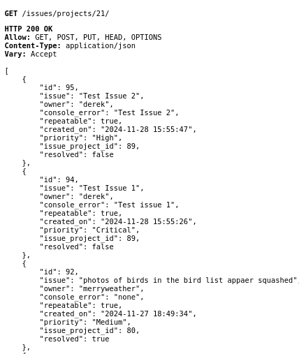
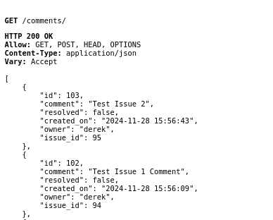
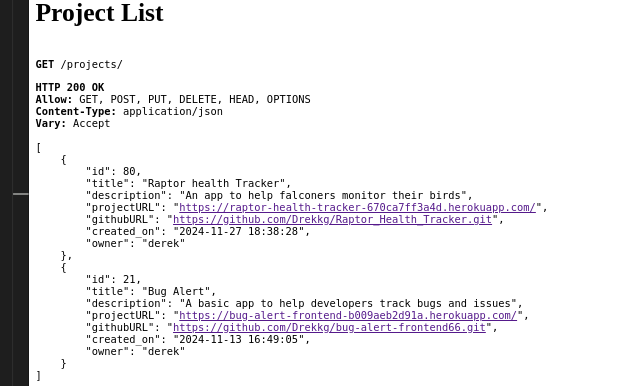
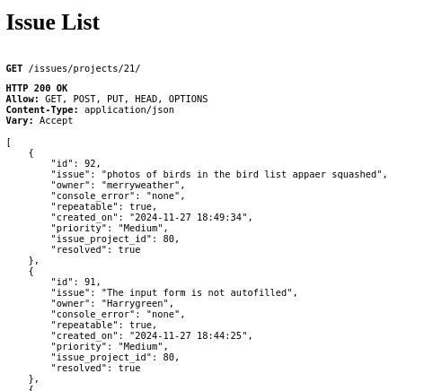
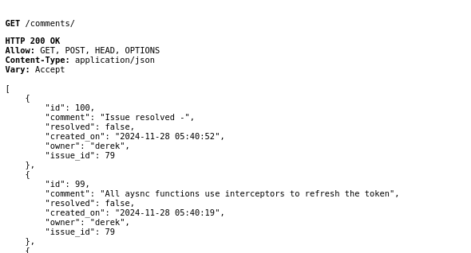
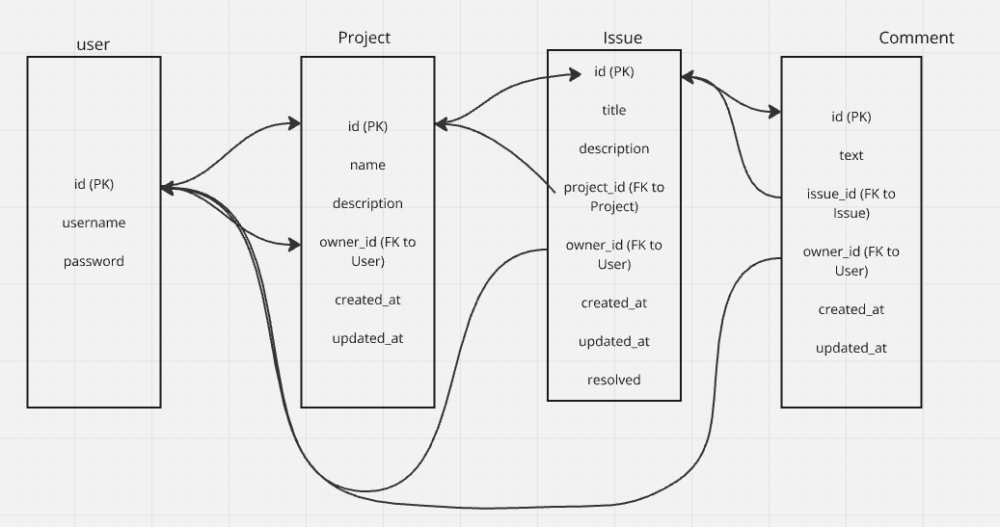
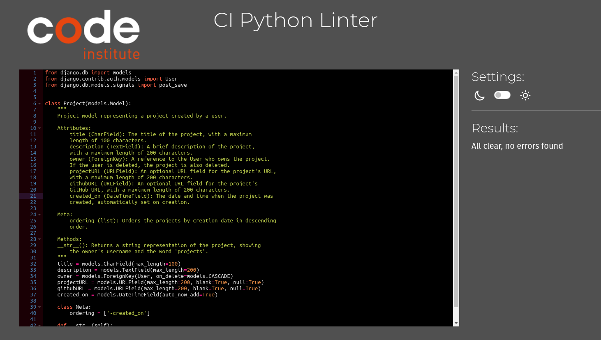
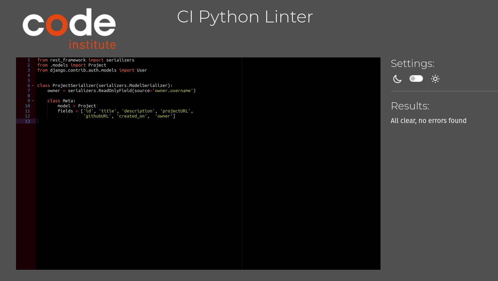
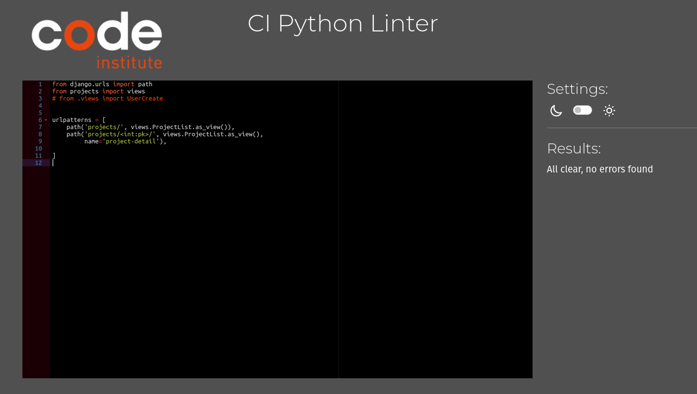
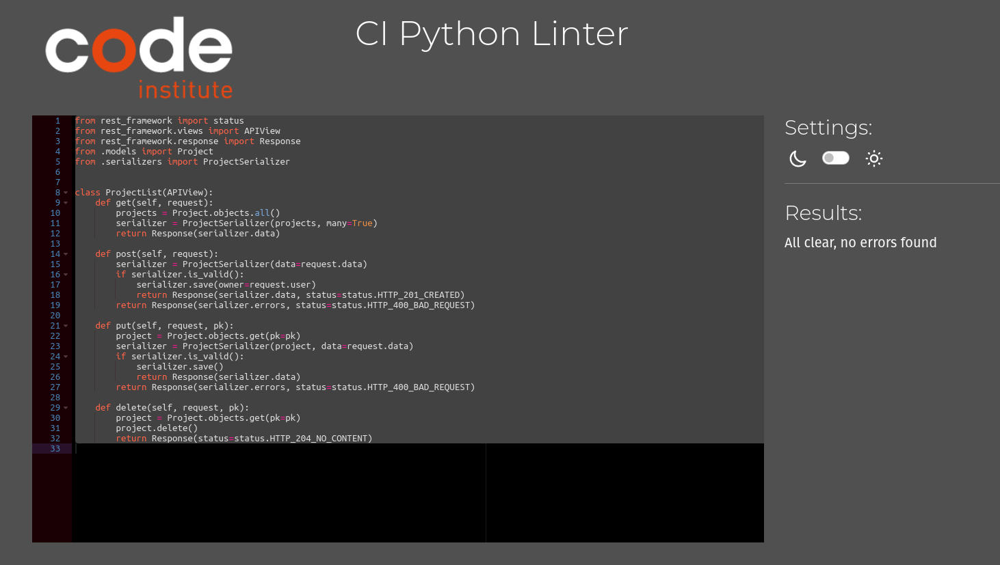

# Bug Alert Django Rest Framework Back End

## Overview

Bug Alert DRF is the back end for the Bug Alert React Application.
It serves as a model of the database to store the information regarding
projects that wish to be tracked, issues, bugs and console errors that have observed. Bug Alert DRF conssits of three apps and models that store, update, retrieve and delete all neccassary information.

**Live Site**

https://bug-alert-drf-7540ff833a9e.herokuapp.com/

**Repository**

https://github.com/Drekkg/bug-alert-drf22.git

**Author**

Derek Garnett

## User Experience (UX)

Working correctly the user should not be aware of Bug Alert DRF.
The data is seamlessly manipulated in the background.

## Features

Full CRUD functionality.
Create - The user can create a project and add issues and comments.
Retrieve - The user can read the data for projects, issues and comments.
Update - The user can make changes to the project.
Delete - The user can delete a project and all relavant issues and comments.

### Features Left to Implement

- Updating issues and comments
- Deleting individual comments and issues

## Technologies Used

- Django rest framework 3.4
- Django allauth 0.50
- Django dj-rest-auth 2.14
- Django simplejwt 4.7

### Languages

Python 3

## Testing

**Manual Testing**

- The deployed Bug Alert DRF was extensively tested through the front end.
  Projects, issues, comments, and resolved status were properly retrieved, updated and deleted.
  Furthermore accessing the database on Heroku the correct behaviour could be observed.
  The following screenshots confirm observed behaviour.

  **Adding a project**

  A project named "Test Test Test" is added to the table.

An issue named "Test 1" and "Test 2" are added to the issues table.

Comments "Test issue 1 comment" and "Test issue 2 comment" are added to the comments table.

The project "Test Test Test" is deleted and as expected the related comments and issues are also deleted.

## Database

The DB is is a postgres relational database and consists of three apps and models.

**User**

Created automatically by Django Restframework

**Projects**
Contains the following fields:

id (PK)

name

description

owner_id (FK to User)

created_at

updated_at

**Issues**
Contains the following fields:

id (PK)

title

description

project_id (FK to Project)

owner_id (FK to User)

created_at

updated_at

resolved

**Comments**
id (PK)

text

issue_id (FK to Issue)

owner_id (FK to User)

created_at

updated_at

**Entity Relationship diagram**

All models contain an appropriate serializer to convert the querysets into JSON and vice versa.
All models have appropriate views and URL patterns to direct the data to the correct table.

## Issue and Bugs

The database works without any major errors.
The design of the models though functional could be improved.
A get request to the issues and comments will retrieve all comments and issues
which is then filtered on the front end. This should be filterd on the back end and is slated as feature to be added in a future release.

## Python Validation

###Projects

**models.py**

**serializers.py**

**urls.py**

**views.py**

## Deployment

### Deployment to Heroku

### Acknowledgements

- [Any acknowledgements or thanks]

## Acknowledgements

- [Thank anyone who helped or inspired you in the creation of this project.]
